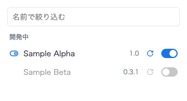

# Extension Toggles

インストールしている拡張機能の有効/無効を、ツールバーのポップアップから切り替える Chrome 拡張 (MV3)。
開発中の拡張(パッケージ化されていない拡張)は、ボタン1つでディスクから再読み込みできる。

`chrome://extensions` を開いて目的の拡張を探す手間を省くためのもの。

## 機能

- インストール済みの拡張機能を名前順に一覧表示し、トグルで有効/無効を切り替える
- 名前で絞り込む
- 開発中の拡張は「開発中」としてまとめて上に出し、再読み込みボタンを付ける
- `chrome://extensions` などほかの場所での変更も、開いているポップアップにすぐ反映する

テーマ・アプリと、この拡張自身は一覧に出さない。管理者のポリシーで入っている拡張は
トグルが押せない状態で表示する。

## 再読み込みでできること・できないこと

再読み込みボタンは、拡張を一度無効にしてすぐ有効に戻す。これで次のものはディスクから読み直される。

- service worker や popup などの JS・HTML・CSS
- content script のファイル

**`manifest.json` の変更は反映されない。** 権限・content script の `matches`・ファイルの追加などを
変えたときは、これまでどおり `chrome://extensions` の更新ボタンを使う。
`chrome://extensions` のボタンが使っている API は普通の拡張からは呼べないため。

どちらの方法でも、すでに開いているタブの content script は、ページをリロードするまで古いまま。

## インストール

1. `chrome://extensions` を開く
2. 「デベロッパーモード」をオンにする
3. 「パッケージ化されていない拡張機能を読み込む」でこのフォルダを選ぶ

インストール時に「アプリ、拡張機能、テーマを管理」という権限の警告が出る。
ほかの拡張を有効/無効にするために必要な `management` 権限によるもの。外部への通信はしない。

## 開発

実機テストは Playwright + Brave Browser Nightly。詳細は
`.claude/skills/extension-toggles/SKILL.md` を参照。

## ライセンス

[MIT](LICENSE)
